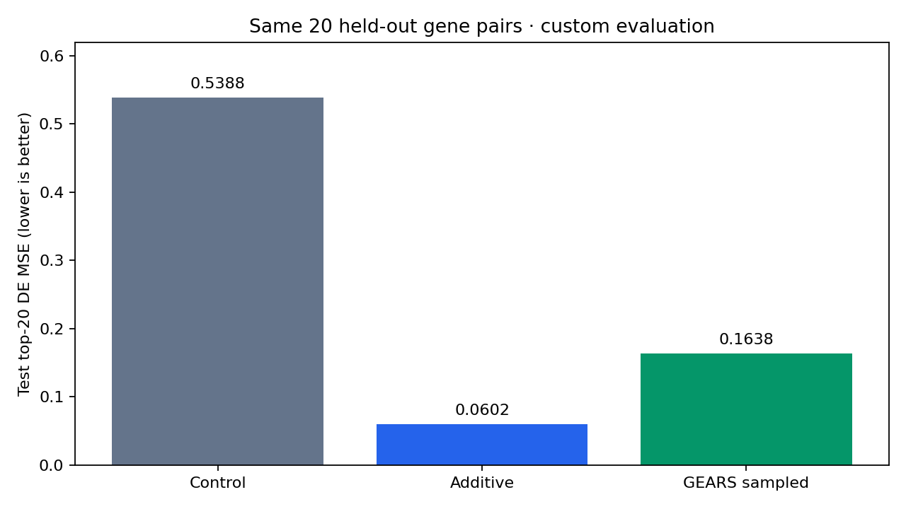

# Predicting two-gene CRISPR activation responses in human K562 cells

This project asks whether a graph neural network can predict a cell population's gene-expression response to activating two genes together better than a simple additive baseline. It compares control expression, an additive prediction, and a local GEARS experiment on the same held-out gene pairs.

The biology comes from **Norman et al. (2019)**: CRISPR activation increases targeted gene activity in human K562 cells, and single-cell RNA sequencing measures the response. This is an expression-prediction project, rather than a gene-knockout experiment or a clinical prediction tool. [Original study](https://pmc.ncbi.nlm.nih.gov/articles/PMC6746554/)

## Interactive dashboard

[Open the live CRISPR Perturbation Explorer](https://crispr-perturbation-explorer.ryan-m-zheng07.chatgpt.site)

Enter through a compact introduction and a 3D camera approach to a full-screen constellation. Pairs, methods, and instructions appear in the same unframed results area, with contextual definitions and navigation back to the explorer. Explore the 20 measured test pairs, switch between Explorer and Scientist explanations, compare observed expression with additive and GEARS predictions, and download the pair results. The constellation maps evaluated pairs; its layout has no biological meaning. Selecting an unsupported combination displays a no-result state.

The Next.js frontend lives in [`web/`](web/README.md). It uses a compact, verified export of the completed 29,766-cell experiment. Viewing the dashboard requires no raw data, model checkpoint, or Python environment.

```bash
cd web
npm ci
npm run dev
```

Open the local address printed by Next.js. See the [frontend README](web/README.md) for static builds, browser checks, GitHub Pages subpath configuration, and replacing the data. From the repository root, `python3 export_dashboard_data.py --check` verifies the checked-in export against local source artifacts; it does not retrain the model.

## Results and experiment status

The revised GEARS experiment trained on **29,766 cells**, capped at 128 per original condition label. Training completed in **6.8 minutes** on an Apple GPU. The additive baseline performed better on average than both this run and the earlier 7,584-cell pilot. The revised run incorporates the changes documented in [AUDIT.md](AUDIT.md).

These are measured results on the same 20 held-out gene pairs; lower error is better.

| Model / experiment | Training observations used | Test top-20 DE MSE ↓ |
| --- | --- | ---: |
| Predict control expression | All 7,353 training controls | 0.5388 |
| Additive baseline | All 54,931 training control/single-gene cells | **0.0602** |
| GEARS pilot | 7,584 sampled outcome cells; cap 32 per original label | 0.1391 |
| GEARS revised sampled run | 29,766 sampled outcome cells; cap 128 per original label | 0.1638 |

Revised checkpoint: **epoch 2 of 7 completed epochs**, selected using validation scores only. GEARS beat additive on **3 of 20 test pairs**. Reloading the checkpoint on CPU reproduced representative GPU predictions; the largest observed absolute difference was 5.2e-06. The documented cross-device tolerance is `rtol=1e-4, atol=1e-5`.

Pilot checkpoint: epoch 12 of 17 completed epochs; GEARS beat additive on 5 of 20 test pairs. Both GEARS runs use all 7,353 training controls as their input pool and reference mean, despite their caps on training outcome cells.



The larger experiment changes sampling, graph filtering, coexpression batching, and the learning-rate schedule. Its comparison cannot isolate the effect of adding data alone. The test set was already inspected in the pilot, so the revised result is exploratory; epochs are selected using validation scores only.

The additive baseline uses all 54,931 available training single-gene/control observations, while revised GEARS learns from capped outcome observations. The comparison reports these particular workflows with different outcome sample sizes; it does not isolate architecture under equal sampling. A full-data training attempt was stopped at the user's request before final test scoring; its partial outputs are retained locally and excluded from Git.

The pilot notebook and outputs are historical records. Its training commands are superseded by the revised workflow below. Selecting `--runtime-variant official` restores the upstream model class, but does not restore the pilot's original graph construction or entire training protocol; the current script does not provide an exact historical-pilot retraining command.

## Install and open the notebooks

Use **Python 3.10**; the original environment used Python 3.10.11 on macOS. Open Terminal and clone the repository:

```bash
git clone https://github.com/zhengrya000/RISPR-perturbations-in-human-K562-leukemia-cells.git
cd RISPR-perturbations-in-human-K562-leukemia-cells
python3 --version
```

If `python3` is Python 3.10, create a project environment and install the pinned packages:

```bash
python3 -m venv .venv
source .venv/bin/activate
python -m pip install -r requirements.txt
python -c "import torch, torch_geometric, anndata; from gears.model import GEARS_Model; print('Imports worked')"
```

If another Python version is your default, use your Python 3.10 executable for the `-m venv` command. The virtual environment keeps this project's packages together. To work in VS Code, open this folder, open a notebook, choose **Select Kernel → Python Environments**, and select `.venv/bin/python`.

The initial data download is approximately 179 MB; extracted inputs use approximately 2.3 GB. Training needs additional memory and storage for dense training arrays, graphs, and checkpoints. This preparation workflow avoids the several-gigabyte GEARS cell-graph cache.

## Reproduce the experiment

With the environment activated, run:

```bash
make reproduce DEVICE=mps BATCH_SIZE=64
```

This downloads missing source files, recreates the split and baselines, trains using the cap of 128 cells per original training label, verifies the selected checkpoint on CPU, and generates an executed report notebook. `mps` selects the Apple GPU on a supported Mac. Check availability with:

```bash
python -c "import torch; print(torch.backends.mps.is_available())"
```

For a machine without an available Apple GPU, use `make reproduce DEVICE=cpu`. CPU and GPU timing and floating-point results can differ. The default run directory is `results/gears_medium`; rerunning training in that directory replaces its model and metrics. To preserve an existing run:

```bash
make reproduce DEVICE=mps RUN_DIR=results/gears_my_run RUN_NAME=gears_my_run
```

The workflow can also be run one stage at a time:

```bash
make prepare
make smoke DEVICE=mps
make train DEVICE=mps
make verify
make report
```

`smoke` performs eight training batches and a small inference check in a separate smoke directory. It does not count as the full experiment. `prepare` preserves already-downloaded input files. To prepare without network access, use `python prepare_project06.py --offline`.

For reference, the revised training command is:

```bash
python train_project06.py --device mps --cell-cap 128 --batch-size 64 \
  --epochs 20 --patience 5 --seed 1 --hidden-size 64 \
  --lr 0.001 --lr-step-size 5 --lr-gamma 0.5 \
  --runtime-variant batch-corrected --loss-implementation vectorized \
  --run-name gears_medium --output-dir results/gears_medium
```

`--cell-cap 128` samples at most 128 cells per original condition label; labels with fewer cells retain all their available observations. It caps training outcomes, while the model's input control pool still uses all training controls. The saved `experiment_plan.json` records the arguments, actual sample size, and source-code hashes before model training.

## Data, split, and evaluation

We use GEARS's processed Norman dataset without repeating raw-data normalization. The downloaded expression file contains 91,205 cells. Applying the GEARS gene-reference eligibility filter retains **89,357 cells, 5,045 measured genes, and 277 original condition labels**. The original study's source data are available as [GEO GSE133344](https://www.ncbi.nlm.nih.gov/geo/query/acc.cgi?acc=GSE133344); this project downloads processed benchmark inputs from Harvard Dataverse using the [official GEARS loader's URLs](https://github.com/snap-stanford/GEARS/blob/master/gears/pertdata.py).

The custom split uses seed 1 and groups equivalent gene identities before assigning conditions. For example, `A+B` and `B+A` represent the same pair; `A+ctrl` and `ctrl+A` represent the same single-gene identity. All cells from an identity remain in one split.

| Split | Distinct gene pairs | Single-gene identities | Cells |
| --- | ---: | ---: | ---: |
| Training | 88 | 102, plus control | 79,170 |
| Validation | 20 | 0 | 5,026 |
| Test | 20 | 0 | 5,161 |

Every held-out pair has both constituent single-gene conditions in training. This evaluates **new combinations of seen genes**. It is a custom split, rather than a published benchmark reproduction.

The 79,170 training cells above describe the available split. The revised model samples from those cells using its cap of 128; validation and test condition means continue to use all 5,026 and 5,161 corresponding cells.

For every measured gene, the additive baseline predicts:

```text
mean(expression after A+B) ≈ mean(after A) + mean(after B) − mean(control)
```

Those input means use only training controls and single-gene cells, pooling equivalent labels by cell count. Additivity is defined on the existing processed expression scale.

The primary metric is mean squared error on each condition's saved top 20 differentially expressed genes. Predictions are compared with observed **condition means**, errors are averaged across equivalent labels within a pair, and pairs receive equal weight. Lower error is better. The DE gene lists depend on observed outcomes and are reserved for validation/final scoring; they are not model inputs or training loss masks. All-gene MSE is a secondary metric.

## Revised GEARS protocol

The revised run uses a cap of 128 outcome cells per original training label, GEARS hidden size 64, batch size 64, Adam with learning rate 0.001 and weight decay 0.0005, a maximum of 20 epochs, and early stopping after five epochs without validation improvement. The learning rate halves every five epochs. The selected checkpoint minimizes validation pair-average top-20 DE MSE; test scoring happens afterward.

The ontology graph uses the fixed GEARS reference gene set, Jaccard weights greater than 0.1, and up to 20 neighbors plus self per target. The coexpression graph uses sampled training single-gene/control cells with absolute Pearson correlations greater than 0.4. Nonzero loss masks use sampled training outcomes only. Prediction averages 32 repeated training-control-mean inputs per condition.

`gears_runtime.py` provides an explicitly identified **batch-corrected** GEARS variant and an equivalent vectorized version of the GEARS loss. It fixes coexpression graph processing across cells in a batch while retaining GEARS parameter names and layer structure. The loss retains averaging by condition, cell, and retained gene. The installed GEARS package is preserved; see [AUDIT.md](AUDIT.md) for evidence and qualifications.

## Files and checks

| File / directory | Purpose |
| --- | --- |
| `prepare_project06.py` | Download, validate, inspect, split, and calculate baselines without cached cell graphs |
| `train_project06.py` | Train, select a checkpoint, evaluate, and save reproducibility records |
| `gears_runtime.py` | Corrected graph batching and vectorized loss |
| `report_project06.py` | Generate explanations, plots, and an executed notebook from saved outputs |
| `project06.ipynb` | Initial data inspection |
| `project06_baseline.ipynb` | Split and additive-baseline walkthrough |
| `project06_gears.ipynb` | Historical pilot walkthrough |
| `project06_gears_medium.ipynb` | Executed report for the completed sampled run |
| `results/` | Split, baseline metrics, DE gene lists, source manifest, and figures |
| `results/gears_local/` | Preserved pilot outputs |
| `results/gears_medium/` | Revised configuration, training history, predictions, metrics, and checkpoint |
| `AUDIT.md` | Setup findings, corrections, and experimental limitations |

For the revised run, inspect `run_summary.json`, `model_comparison.csv`, `test_pair_comparison.csv`, `training_history.csv`, `checkpoint_verification.json`, and `explanatory_examples.csv`. Example pairs are chosen after scoring to show the largest relative advantages and disadvantages; they are descriptive illustrations, not tuning inputs.

Run the runtime-equivalence tests and preparation reproduction check with:

```bash
python -m unittest discover -s tests -v
make check-preparation
```

The preparation check regenerates scientific artifacts in `results/preparation_check`, compares them with the original split and baselines at `1e-12` tolerance, checks alias grouping and split separation, and exercises the guard rejecting held-out means as baseline inputs. `data_sources.json` records source URLs, byte counts, and SHA256 hashes. `model.pt` and `config.pkl` preserve checkpoint weights and graph configuration for local inference.

To rebuild an existing revised-run report without retraining:

```bash
python report_project06.py --run-dir results/gears_medium
```

After a fresh clone, regenerate ignored binary arrays with the workflow before running this report command.

## Scope and Git contents

One split and one seed in one processed CRISPRa dataset do not establish model superiority across settings. This project does not evaluate unseen genes, new cell types, or independent biological replicates. Bootstrap intervals across pairs describe these held-out results; shared genes and experimental dependencies limit their interpretation. The GEARS training objective and condition-mean evaluation target different quantities, so more training does not guarantee beating additive.

Git includes code, walkthroughs, compact metrics, protocol records, and plots. `.gitignore` excludes downloaded data, virtual environments, caches, checkpoint/graph/prediction binary arrays, per-cell barcode tables, and scratch notebooks. These remain local or are regenerated; the repository does not carry the full dataset or trained weights. Phase-specific inspection/baseline summaries describe their stage; the completed run's `run_summary.json` records model-training status.

## References

- Norman et al. (2019), [Exploring genetic interaction manifolds constructed from rich single-cell phenotypes](https://doi.org/10.1126/science.aax4438), *Science*. [Study manuscript](https://pmc.ncbi.nlm.nih.gov/articles/PMC6746554/), [source data](https://www.ncbi.nlm.nih.gov/geo/query/acc.cgi?acc=GSE133344).
- Roohani, Huang, and Leskovec, [Predicting transcriptional outcomes of novel multigene perturbations with GEARS](https://doi.org/10.1038/s41587-023-01905-6), online 2023 / *Nature Biotechnology* 2024. [Official implementation](https://github.com/snap-stanford/GEARS).
- Processed inputs and reference graphs: [Norman archive](https://dataverse.harvard.edu/api/access/datafile/6154020), [gene-to-GO reference](https://dataverse.harvard.edu/api/access/datafile/6153417), [reference gene set](https://dataverse.harvard.edu/api/access/datafile/6934320).
